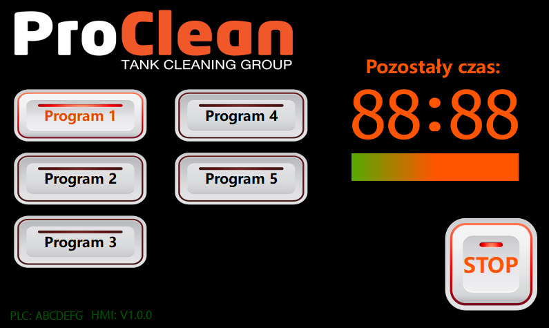
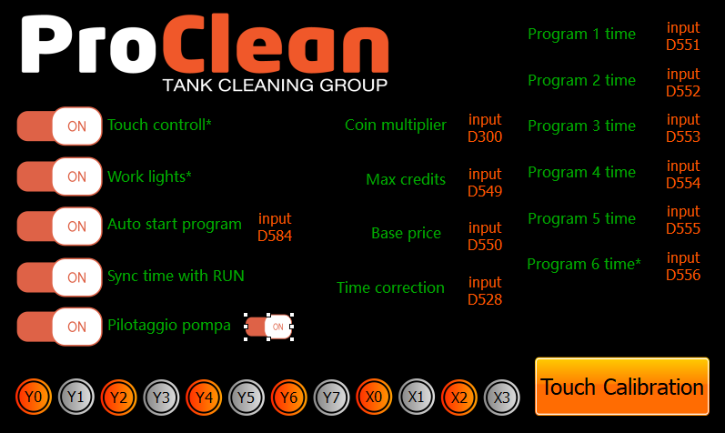
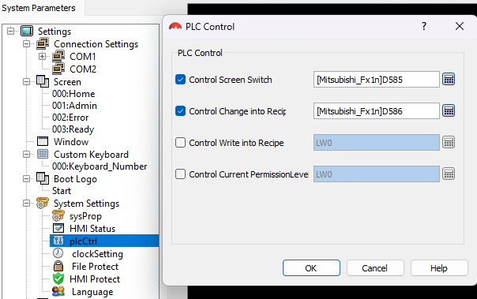
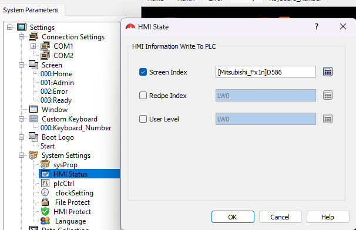
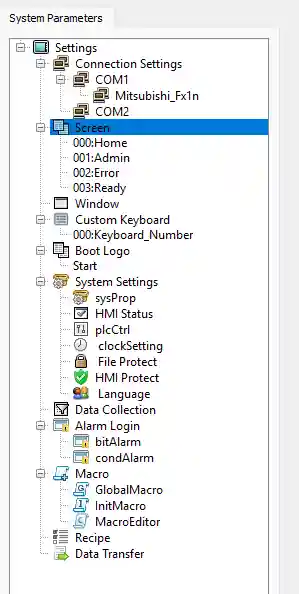
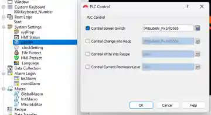
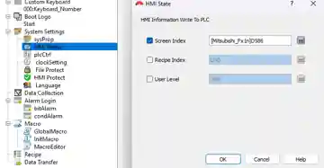

# HMI — WSStudio / KinSealStudio — V1.5.7

## Plik źródłowy projektu HMI

Głównym edytowalnym plikiem projektu jest:

```text
projects/hmi/pitstart.hs
```

Plik należy dodać ręcznie do repo pod dokładnie tą nazwą.

Z nagłówka aktualnego projektu `.hs` odczytano:

```text
KinSealStudio V1.0.2
SUP070
wsb-070-16M
7.0 inch
800 x 480
1667M Colors 7 TFT LCD
DC24V (+/-15%)
COM1 / COM2
USB device
Language: English
PLC driver: Mitsubishi_Fx1n
```

Szczegółowy opis pliku znajduje się w [projects/hmi/README.md](../projects/hmi/README.md).

`projects/hmi/pitstart_hmi.zip` pozostaje starszym archiwum transportowym; przy dalszej edycji jako źródło należy traktować `pitstart.hs`.

## Ekrany

Projekt używa czterech ekranów:

| Index | Nazwa | Funkcja |
|---:|---|---|
| 0 | Home | praca, wybór programu, czas i STOP |
| 1 | Admin | ustawienia i parametry |
| 2 | Error | Stanowisko nieczynne |
| 3 | Ready | Stanowisko wolne |

Sterowanie numerem ekranu:

```text
D585 = HMI_SCREEN_INDEX          PLC -> HMI
D586 = HMI_CURRENT_SCREEN_INDEX HMI -> PLC
```

### Warunki D585

```text
D585=1  Admin                  gdy X14/M303=1
D585=2  Stanowisko nieczynne   gdy X14=0 i X0/M300=0
D585=3  Stanowisko wolne       gdy X14=0, X0=1 i M427=0
D585=0  Home                   w pozostałym przypadku
```

Priorytet: **Admin > Stanowisko nieczynne > Stanowisko wolne > Home**.

## Podgląd ekranów

### 000: Home


Home zawiera przyciski P1…P6, pozostały czas, pasek pozostałego czasu i STOP.

### 001: Admin

Aktualny układ ekranu Admin zawiera:

- Touch control — funkcja lokalna HMI,
- Work lights — `M414`,
- Pilotaggio pompa — `M410`,
- Sync time with RUN — `M429`,
- Auto start program — `M431`,
- wybór programu Auto Start — `D584`, zakres 1…6, prezentowany jako P1…P6,
- Coin multiplier — `D300`,
- Max credits — `D549`,
- Base price — `D550`,
- Time correction (%) — `D528`,
- P1…P6 time — `D551…D556`,
- Touch Calibration,
- przycisk powrotu do Home.

Stary podgląd Admin został usunięty z repozytorium.

### 002: Error — Stanowisko nieczynne


Ekran jest wybierany przy `D585=2`.

### 003: Ready — Stanowisko wolne


Ekran jest wybierany przy `D585=3`.

## Aktualne zrzuty HMI — V1.5.6

Poniższe nazwy są przeznaczone dla aktualnych zrzutów projektu. Pliki należy ręcznie dodać do `docs/images/hmi/`.

### 000: Home — aktualny widok



### 001: Admin — aktualny widok



### 002: Error — Stanowisko nieczynne


### 003: Ready — Stanowisko wolne


### PLC Control / Control Screen Switch



### HMI Status / Screen Index



## Konfiguracja WSStudio

### Lista ekranów



W `System Parameters -> Screen` powinny istnieć:

```text
000:Home
001:Admin
002:Error
003:Ready
```

### PLC Control



W `System Settings -> plcCtrl`:

- **Control Screen Switch**: ON,
- adres: `[Mitsubishi_Fx1n]D585`.

HMI przełącza ekran zgodnie z liczbą wpisaną przez PLC do D585.

### HMI Status



W `System Settings -> HMI Status`:

- **Screen Index**: ON,
- adres: `[Mitsubishi_Fx1n]D586`.

D586 jest zapisywany przez HMI i podaje PLC indeks aktualnie wyświetlanego ekranu. PLC nie zapisuje D586.

## Dokumentacja i oprogramowanie HMI

Model używany w projekcie: **SEEKU / Winsun WSB7020R**, 7", wersja z wyjściami przekaźnikowymi.

Producent podaje dla serii WSB oprogramowanie **HMI_Setup V5.1**. Strona modelu zawiera parametry urządzenia oraz sekcję pobierania programu i instrukcji.

- [WSB7020R — strona producenta](https://www.winsunzk.cn/pdetail/672317c74fbc8440b904f66a)
- [WS/WSB HMI&PLC All-in-one User Manual v1.79 — PDF](https://www.winsunzk.cn/upload/application/upload_645b146784a24ab5f250e183416890b1.pdf)
- [HMI_Setup V5.1 — pakiet producenta](https://www.winsunzk.cn/upload/application/upload_594f4ede25a16934f8723e5d2ff08091.zip)
- [Angielski opis WS7020R / WSB7020R — Manuals+](https://manuals.plus/ae/1005009073971796)

Projekt HMI z tego repo:
- [projects/hmi/pitstart.hs](../projects/hmi/pitstart.hs) — główny plik źródłowy,
- [projects/hmi/README.md](../projects/hmi/README.md) — opis projektu,
- [projects/hmi/pitstart_hmi.zip](../projects/hmi/pitstart_hmi.zip) — starsze archiwum transportowe.

Dokumentacja PLC:
- [opis logiki PLC](LADDER_LOGIC.md),
- [konfiguracja RM5](RM5.md),
- [główny README projektu](../README.md).

### Komunikacja HMI <-> PLC

Dla protokołu Mitsubishi FX1N dokumentacja rodziny podaje konfigurację po stronie HMI z prędkością 38400 bps i komunikacją RS232. W projekcie należy zachować ustawienia zgodne z faktycznie używanym portem i sterownikiem.

Po pobraniu projektu do panelu przewód użyty wyłącznie do downloadu nie powinien pozostawać podłączony, jeżeli blokuje wewnętrzną komunikację HMI z PLC.

## Home

### Przyciski

| Funkcja | zapis HMI | status |
|---|---:|---:|
| STOP | M400 momentary | M412 |
| P1 | M401 momentary | M420 |
| P2 | M402 momentary | M421 |
| P3 | M403 momentary | M422 |
| P4 | M404 momentary | M423 |
| P5 | M405 momentary | M424 |
| P6 | M406 momentary | M425 |

### Czas MM:SS

- `D540` — minuty,
- `D541` — sekundy.

Oba pola: **16-Bit Unsigned Int**, tylko odczyt. D541 powinno mieć dwie cyfry z zerem wiodącym.

`M426=1` oznacza poprawny czas do wyświetlenia.

### Pasek czasu

- wartość: `D350`,
- minimum: 0,
- maksimum dynamiczne: `D559 = TIME_BAR_MAX`.

D559 nie maleje podczas normalnego odliczania, więc pasek pokazuje proporcję czasu pozostałego do maksymalnego czasu bieżącej sesji/programu.

### Kredyt

`D582` = pozostały kredyt w centach.

## Admin — adresy

| Adres | Funkcja | Zakres / ustawienie |
|---|---|---|
| D300 | Coin multiplier / wartość impulsu CH1 [x0,10 EUR] | 1…100 |
| D549 | Max credits [x0,10 EUR] | 1…999 |
| D550 | Base price [x0,10 EUR] | 1…D549 |
| D528 | Time correction x100 | 50…200 |
| D551…D556 | P1…P6 time [s] | 1…600 |
| D584 | Auto Start Program | 1…6 |
| M410 | Pilotaggio pompa | toggle, bieżący stan sterowania |
| M439 | Pilotaggio default | toggle, default ON; używane po zakończeniu impulsów Y0 gdy M410=OFF |
| M414 | Work lights | toggle |
| M429 | Sync time with RUN | toggle, default ON |
| M431 | Auto start program | toggle, default ON |

D584: 1=P1, 2=P2, 3=P3, 4=P4, 5=P5, 6=P6.

## RM5 / sygnał HMI

Po zaakceptowanym impulsie RM5:

- `M419` jest aktywne około 3 s,
- `D587` jest word-mirrorem M419 (0/1),
- `D565` zwiększa licznik zaakceptowanych zdarzeń.

W dostępnej konfiguracji WSStudio nie ma potwierdzonej osobnej funkcji „wake by PLC word”; D587 pozostaje sygnałem do diagnostyki lub wykorzystania przez mechanizm zdarzeń, jeśli dana wersja HMI go obsługuje.

## Statusy diagnostyczne

| Adres | Znaczenie |
|---|---|
| M300 | automat dostępny / X0 |
| M301 | RUN / PRACA |
| M412 | WORK_ACTIVE |
| M413 | wartość RM5 poprawna |
| M415 | konfiguracja taryfy poprawna |
| M419 | HMI wake request |
| M426 | czas ważny |
| M427 | kredyt dostępny |
| M435 | limit kredytu osiągnięty / zarezerwowany |
| M436 | obsługa doładowania RM5 w toku |
| M448 | COUNTDOWN_LOCAL_ACTIVE — gałąź odliczania dla M429=0 |
| M449 | COUNTDOWN_ACTIVE — M412 przy M429=0 lub M301/RUN przy M429=1 |
| D521 | ostatnia paczka RM5 |
| D522 | impulsy Y0 z ostatniej paczki |
| D524 | impulsy RM5 sesji |
| D533 | impulsy Y0 faktycznie wysłane |
| D557 | czas taryfy wybranego programu |
| D558 | numer wybranego programu |
| D560 | pozostały kredyt w centach |
| D565 | licznik zdarzeń RM5 |

## STOP podczas RUN

Przy `M429 = Sync time with RUN = ON` odliczanie śledzi bezpośrednio `M301 = RUN/PRACA`.

STOP wyłącza aktywny program i jego wyjścia, ale nie zatrzymuje czasu, jeśli `M301/RUN` nadal ma stan 1. Po zaniku RUN odliczanie zatrzymuje się.

Przy `M429=0` odliczanie zależy od `M412=WORK_ACTIVE`.

`M448` jest wewnętrzną gałęzią dla trybu lokalnego, a `M449` końcową bramką odliczania. HMI nie steruje nimi bezpośrednio.

## Wersja PLC

```text
D500..D503 = V1.5.7
D516 = 1
D517 = 5
D518 = 7
```


### Pilotaggio default

Na ekranie Admin:

```text
M410 = Pilotaggio pompa        ; bieżący stan
M439 = Pilotaggio default      ; wartość domyślna po zakończeniu impulsów Y0
```

Od V1.5.5 `M439` nie jest kopiowane przy rozpoczęciu programu.

Po zakończeniu całej kolejki impulsów `Y0`:
- gdy `M410=1`, PLC pozostawia sterowanie bez zmian,
- gdy `M410=0` i `M439=1`, PLC ustawia `M410=1`,
- gdy `M410=0` i `M439=0`, sterowanie pozostaje wyłączone.

PLC pobiera aktualną wartość `M439` z HMI w chwili zakończenia kolejki. Jeśli w tym momencie trwa już zbieranie kolejnej paczki RM5, zastosowanie wartości domyślnej jest odłożone do zakończenia jej obsługi.

`M447 = NEW_PROGRAM_START` pozostaje markerem diagnostycznym i nie steruje już `M410`.

### Domyślna taryfa

```text
D300 = 10
D550 = 10
D551 = 300
D552 = 300
D553 = 300
D554 = 300
D555 = 300
D556 = 300
```

Jeden impuls RM5 odpowiada domyślnie 5 minutom.
