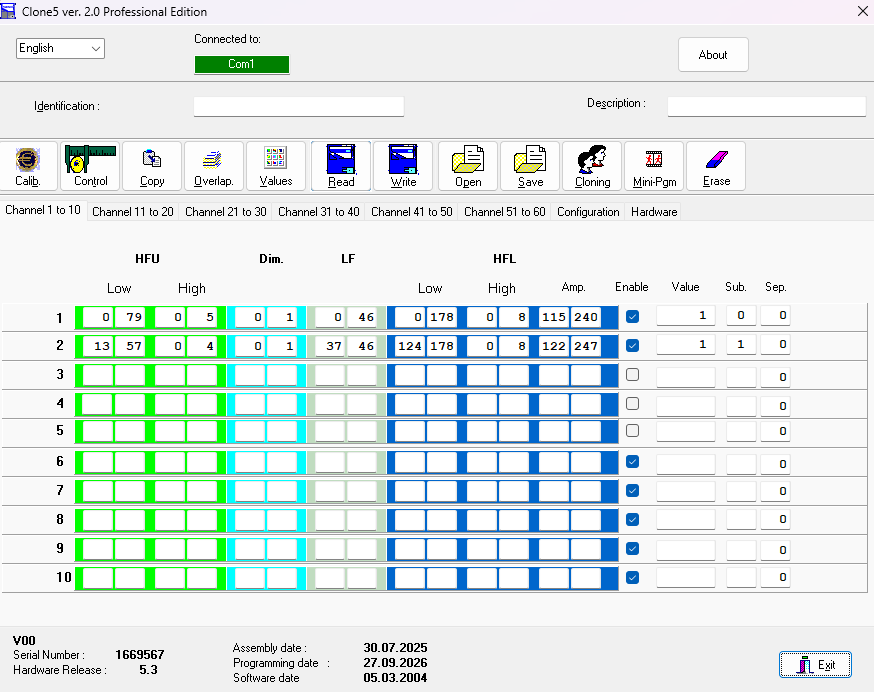
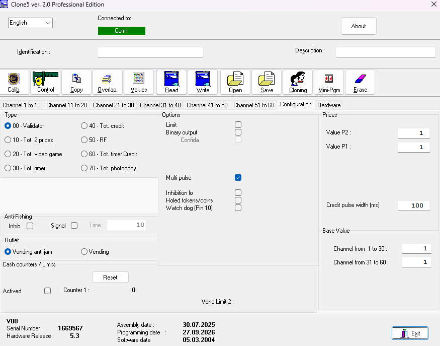

# Comestero RM5 Evolution — V1.4.9

## Założenie projektu

PLC korzysta tylko z jednego wejścia impulsowego z akceptora:

- RM5 pin 7 / CH1 -> X27.

Dlatego **wszystkie używane kanały/nominały RM5 muszą być skonfigurowane tak, aby impulsy trafiały na wyjście CH1**.

PLC nie odczytuje bezpośrednio CH2…CH6.

Jeżeli różne nominały mają być rozróżniane wartością, RM5 powinien zakodować je odpowiednią liczbą impulsów CH1. PLC zlicza impulsy na X27 i każdy impuls wycenia według `D300`.

Przykład:
- D300=1 -> jeden impuls CH1 = 0,10 EUR,
- moneta 0,50 EUR powinna wtedy dać 5 impulsów CH1,
- moneta 1,00 EUR -> 10 impulsów CH1,
- moneta 2,00 EUR -> 20 impulsów CH1.

Jeżeli D300=10, jeden impuls CH1 jest wart 1,00 EUR. W takim ustawieniu pojedynczy impuls nie może sam rozróżnić monet o innych wartościach.

## Połączenie RM5

Przy zasilaniu 24 VDC:

- pin 1 GND -> 0 V,
- pin 2 zasilanie -> +24 VDC,
- pin 7 CH1 -> X27,
- pin 6 INHIBIT <- Y2 (główne fizyczne wyjście),
- Y23 pozostaje programowym mirrorem INHIBIT dla przyszłego sterownika z większą liczbą fizycznych wyjść.

## INHIBIT

Aktualna logika:

```text
X0 = 0 -> Y2 = 1 i Y23 = 1 -> RM5 zablokowany
X0 = 1 -> Y2 = 0 i Y23 = 0 -> RM5 odblokowany
```

Instruction List:

```text
LDI X0
OUT Y2

LDI X0
OUT Y23
```

Na obecnym sterowniku do pinu 6 RM5 należy używać **Y2**. Y23 jest zachowane wyłącznie jako zgodny logicznie zapas pod przyszły PLC.

## Konfiguracja Clone5 / RM5

W Clone5 należy skonfigurować akceptor tak, aby:

1. wszystkie używane nominały były aktywne,
2. wszystkie te nominały generowały sygnał na fizycznym wyjściu CH1,
3. liczba impulsów CH1 odpowiadała wartości monety w przyjętej jednostce projektu,
4. INHIBIT był aktywny z wejścia inhibit RM5.

Projekt nie zakłada osobnych wejść PLC dla CH2…CH6.

## Wartość impulsu

`D300` = wartość pojedynczego impulsu CH1 w jednostkach 0,10 EUR.

```text
D300 = 1  -> 0,10 EUR / impuls
D300 = 5  -> 0,50 EUR / impuls
D300 = 10 -> 1,00 EUR / impuls
```

Po zakończeniu paczki:

```text
COUNTER_PULSES = RM5_CH1_PULSES * D300
```

Każdy impuls Y0/Counter odpowiada 0,10 EUR.

## Akceptacja programowa

Impuls X27 jest przyjmowany tylko przy:

- M300=1,
- M413=1,
- M415=1.

Y2/Y23 INHIBIT nadal zależą wyłącznie od X0.

## Diagnostyka

- D320 — impulsy bieżącej paczki RM5,
- D521 — impulsy ostatniej paczki,
- D522 — liczba impulsów Y0 wyliczona z ostatniej paczki,
- D330 — kolejka Y0,
- D524 — impulsy RM5 sesji,
- D533 — impulsy Y0 faktycznie wysłane,
- D565 — licznik zaakceptowanych zdarzeń RM5,
- M419 / D587 — żądanie wake HMI przez około 3 s.


## Clone5 Professional — zrzuty konfiguracji

### Control / diagnostyka


Zakładka pozwala sprawdzić m.in. stan wejścia, INHIBIT, Anti-Fishing, Cash Sensor oraz diagnostykę Sensor / E²prom / Timer / Rom.

### Kanały 1–10



W projekcie PLC wykorzystywane jest tylko fizyczne wyjście **CH1**, dlatego wszystkie obsługiwane nominały należy skonfigurować tak, aby ich impulsy trafiały na CH1. Liczba impulsów musi odpowiadać wartości monety przy przyjętej wartości `D300`.

### Configuration



Dla tego projektu istotne są:
- typ pracy **00 - Validator**,
- aktywne **Inhibition Id**,
- `Credit pulse width` zgodne z wymaganym czasem impulsu wejściowego,
- wyjście wartości monet kierowane na CH1.

PLC nie wykorzystuje osobnych wejść dla CH2…CH6.
