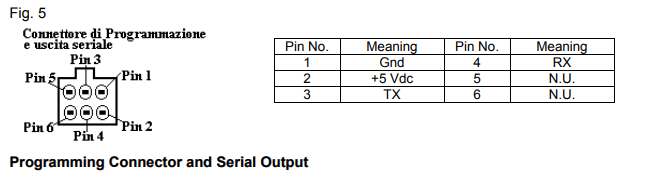
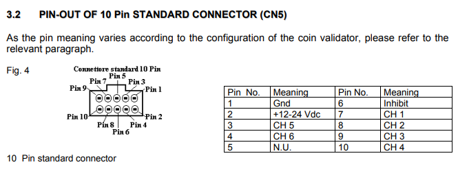
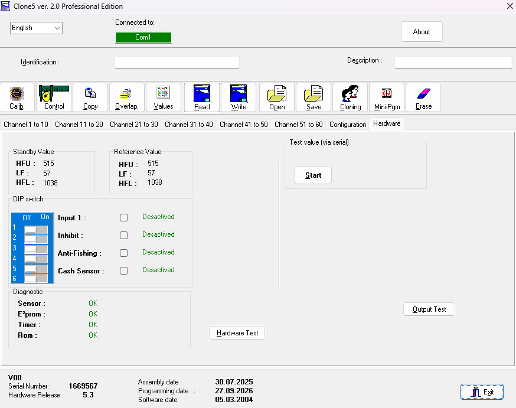

# Comestero RM5 Evolution — V1.5.5

## Założenie projektu

PLC korzysta tylko z jednego wejścia impulsowego z akceptora:

- RM5 pin 7 / CH1 -> X27.

Dlatego **wszystkie używane kanały/nominały RM5 muszą być skonfigurowane tak, aby impulsy trafiały na wyjście CH1**.

PLC nie odczytuje bezpośrednio CH2…CH6.

Jeżeli różne nominały mają być rozróżniane wartością, RM5 powinien zakodować je odpowiednią liczbą impulsów CH1. PLC zlicza impulsy na X27 i każdy impuls wycenia według `D300`.

Przykład:
- D300=1 -> jeden impuls CH1 = 0,10 EUR,
- moneta 0,50 EUR powinna wtedy dać 5 impulsów CH1,
- moneta 1,00 EUR -> 10 impulsów CH1,
- moneta 2,00 EUR -> 20 impulsów CH1.

Jeżeli D300=10, jeden impuls CH1 jest wart 1,00 EUR. W takim ustawieniu pojedynczy impuls nie może sam rozróżnić monet o innych wartościach.

## Połączenie RM5

Przy zasilaniu 24 VDC:

- pin 1 GND -> 0 V,
- pin 2 zasilanie -> +24 VDC,
- pin 7 CH1 -> X27,
- pin 6 INHIBIT <- Y2 (główne fizyczne wyjście),
- Y23 pozostaje programowym mirrorem INHIBIT dla przyszłego sterownika z większą liczbą fizycznych wyjść.

## INHIBIT

Aktualna logika:

```text
X0 = 0 -> Y2 = 1 i Y23 = 1 -> RM5 zablokowany
M435 = 1 -> Y2 = 1 i Y23 = 1 -> osiągnięty/zarezerwowany limit kredytu
X0 = 1 i M435 = 0 -> Y2 = 0 i Y23 = 0 -> RM5 odblokowany
```

Instruction List:

```text
LDI X0
OR M435
OUT Y2

LDI X0
OR M435
OUT Y23
```

Na obecnym sterowniku do pinu 6 RM5 należy używać **Y2**. Y23 jest zachowane wyłącznie jako zgodny logicznie zapas pod przyszły PLC.

## Połączenie serwisowe TTL z Clone5 Professional

RM5 ma osobne 6-pinowe złącze programowania i wyjścia szeregowego. Z dokumentacji:



Pinout złącza programującego:

| Pin | Funkcja |
|---:|---|
| 1 | GND |
| 2 | +5 VDC |
| 3 | TX |
| 4 | RX |
| 5 | N.U. |
| 6 | N.U. |

Do komunikacji z PC używany jest konwerter USB-UART TTL:

```text
USB-UART TX  -> RM5 pin 4 RX
USB-UART RX  -> RM5 pin 3 TX
USB-UART GND -> RM5 pin 1 GND
```

Nie używać klasycznego interfejsu RS-232 z poziomami napięć dodatnich i ujemnych. Nie podawać 12/24 V na piny TX/RX.

Pin 2 złącza serwisowego jest oznaczony jako +5 VDC. Do samej komunikacji wystarczają GND, TX i RX; RM5 może pozostawać zasilany normalnie przez główne złącze CN5.

### COM1

W używanej konfiguracji Clone5 Professional 2.0 wykrywa RM5 po przypisaniu adapterowi USB-UART numeru **COM1**.

Jeżeli Windows nada adapterowi inny numer:

```text
Menedżer urządzeń
  -> Porty (COM i LPT)
  -> właściwości adaptera USB-UART
  -> Ustawienia portu
  -> Zaawansowane
  -> Numer portu COM: COM1
```

Po zmianie numeru portu należy ponownie uruchomić Clone5 Professional.

## Złącze główne CN5 — 10 pin



Pinout CN5 według dokumentacji:

| Pin | Funkcja |
|---:|---|
| 1 | GND |
| 2 | +12…24 VDC |
| 3 | CH5 |
| 4 | CH6 |
| 5 | N.U. |
| 6 | INHIBIT |
| 7 | CH1 |
| 8 | CH2 |
| 9 | CH3 |
| 10 | CH4 |

W tym projekcie używane są przede wszystkim:
- pin 1 — GND,
- pin 2 — zasilanie,
- pin 6 — INHIBIT z Y2,
- pin 7 — CH1 do X27.

## Konfiguracja Clone5 Professional

### Configuration


Stan pokazany na screenie:
- Type: `00 - Validator`,
- `Multi pulse`: ON,
- `Credit pulse width`: **100 ms**,
- Base Value, Channel 1…30: **1**,
- Base Value, Channel 31…60: **1**,
- Output: `Vending anti-jam`,
- `Limit`: OFF,
- `Binary output`: OFF,
- `Inhibition Id`: OFF,
- `Holed tokens/coins`: OFF,
- `Watch dog (Pin 10)`: OFF.

Opcja `Inhibition Id` widoczna w Clone5 nie jest w tej dokumentacji utożsamiana z fizycznym wejściem **INHIBIT na pinie 6 CN5**. Sterowanie fizycznym INHIBIT w projekcie PLC pozostaje zgodne z opisem Y2 -> pin 6.

### Kanały 1–10


Screen dokumentuje aktualne parametry kanałów oraz wartości pomiarowe używanego egzemplarza RM5.

**Wartości HFU / Dim. / LF / HFL / Amp. są danymi kalibracyjnymi konkretnego egzemplarza. Nie należy ich kopiować do innego RM5.**

Dla konfiguracji PLC istotne są pola:
- `Enable`,
- `Value`,
- `Sub.`,
- `Sep.`,
- sposób generowania impulsów wyjściowych.

PLC nie rozpoznaje kanału źródłowego. Odczytuje tylko impulsy na fizycznym CH1 podłączonym do X27.

### Hardware / wartości referencyjne



Dla udokumentowanego egzemplarza ekran pokazuje:

```text
Standby Value:
HFU = 515
LF  = 57
HFL = 1038

Reference Value:
HFU = 515
LF  = 57
HFL = 1038
```

Są to wartości referencyjne **tego konkretnego akceptora**. Przy wymianie RM5 nie należy przepisywać ich do nowego urządzenia.

Na ekranie Hardware można też sprawdzić:
- stan DIP switch,
- Input 1,
- Inhibit,
- Anti-Fishing,
- Cash Sensor,
- diagnostykę Sensor / E²prom / Timer / Rom,
- test wartości przez port szeregowy,
- Hardware Test i Output Test.

## Zasada konfiguracji kanałów dla PLC

W Clone5 należy skonfigurować używane monety tak, aby ich wartość została przekazana przez **CH1** w postaci właściwej liczby impulsów.

Projekt nie wykorzystuje CH2…CH6 jako osobnych wejść PLC.

Przykład dla `D300=1`:

```text
1 impuls CH1  = 0,10 EUR
5 impulsów    = 0,50 EUR
10 impulsów   = 1,00 EUR
20 impulsów   = 2,00 EUR
```

Przy `D300=10` jeden impuls CH1 oznacza 1,00 EUR.

## Wartość impulsu

`D300` = wartość pojedynczego impulsu CH1 w jednostkach 0,10 EUR.

```text
D300 = 1  -> 0,10 EUR / impuls
D300 = 5  -> 0,50 EUR / impuls
D300 = 10 -> 1,00 EUR / impuls
```

Po zakończeniu paczki:

```text
COUNTER_PULSES = RM5_CH1_PULSES * D300
```

Każdy impuls Y0/Counter odpowiada 0,10 EUR.

## Akceptacja programowa

Impuls X27 jest przyjmowany tylko przy:
- M300=1,
- M413=1,
- M415=1.

Y2/Y23 INHIBIT zależą od X0 oraz M435. M435 jest ustawiane także wtedy, gdy kolejny pełny impuls RM5 nie mieści się już w wolnym limicie lub bieżąca paczka RM5 wypełniła pozostałe miejsce.

## Diagnostyka PLC

- D320 — impulsy bieżącej paczki RM5,
- D521 — impulsy ostatniej paczki,
- D522 — liczba impulsów Y0 wyliczona z ostatniej paczki,
- D330 — kolejka Y0,
- D524 — impulsy RM5 sesji,
- D533 — impulsy Y0 faktycznie wysłane,
- D565 — licznik zaakceptowanych zdarzeń RM5,
- M419 / D587 — żądanie wake HMI przez około 3 s.


## Limit kredytu

`D549` ma zakres 1…999 jednostek po 0,10 EUR.

```text
D549 = 50  -> 5,00 EUR
D549 = 999 -> 99,90 EUR
```

Do limitu wliczany jest:
- kredyt w D560,
- kredyt odpowiadający impulsom oczekującym w D330.

Po wypełnieniu limitu M435 blokuje RM5 przez Y2/Y23. Nowa paczka jest dodatkowo ograniczana do liczby impulsów, które mieszczą się jeszcze poniżej D549.
