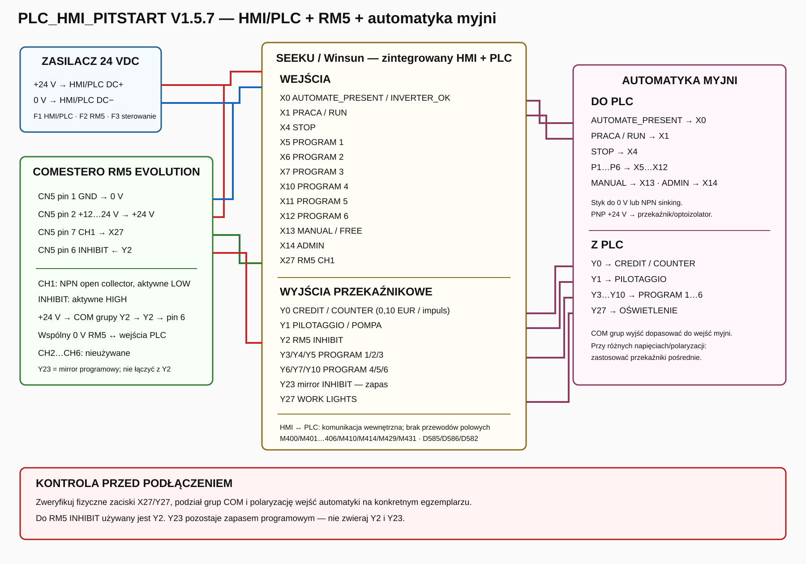

# Techniczny schemat połączeń — PLC_HMI_PITSTART V1.5.7



Schemat przedstawia aktualne mapowanie projektu **PLC_HMI_PITSTART V1.5.7**: zasilanie 24 VDC, Comestero RM5 Evolution, zintegrowany panel HMI/PLC SEEKU/Winsun oraz sygnały wymieniane z automatyką myjni.

## 1. Zasilanie 24 VDC

```text
+24 V  -> HMI/PLC DC+
0 V    -> HMI/PLC DC-

+24 V  -> RM5 CN5 pin 2
0 V    -> RM5 CN5 pin 1
```

RM5 i wejścia PLC muszą mieć wspólne **0 V**.

Zalecany podział zabezpieczeń:
- F1 około 1 A — HMI/PLC,
- F2 około 0,5 A — RM5,
- osobne zabezpieczenie obwodów wykonawczych / cewek przekaźników.

## 2. RM5 Evolution -> PLC

| RM5 CN5 | Funkcja | Połączenie |
|---:|---|---|
| 1 | GND | 0 V / DC- |
| 2 | +12…24 VDC | +24 VDC |
| 6 | INHIBIT | z Y2; +24 V przez styk przekaźnikowy PLC |
| 7 | CH1 | X27 |

### CH1

Wyjście CH1 RM5 pracuje jako **NPN open collector** i jest aktywne stanem niskim. Impuls oznacza zwarcie linii CH1 do GND.

Dla wejścia PLC pracującego w logice NPN połączenie jest:

```text
RM5 pin 7 / CH1 --------> PLC X27
RM5 pin 1 / GND --------> PLC 0 V / COM wejść
```

W projekcie odczytywany jest wyłącznie CH1. CH2…CH6 nie są używane.

Konfiguracja nominałów RM5 powinna przekazywać wartość przez CH1 w trybie Multi Pulse. Szczegóły: [RM5.md](RM5.md).

### INHIBIT

INHIBIT RM5 jest sterowany stanem wysokim. Dla wersji PLC z wyjściami przekaźnikowymi:

```text
+24 V
  |
  +----> COM grupy wyjść zawierającej Y2
                    |
                  [ Y2 ]
                    |
                    +----> RM5 CN5 pin 6 / INHIBIT
```

Aktualna logika PLC:

```text
X0=0 OR M435=1 -> Y2=1 -> RM5 zablokowany
X0=1 AND M435=0 -> Y2=0 -> RM5 odblokowany
```

`Y23` jest programowym mirrorem INHIBIT przeznaczonym jako zapas/kompatybilność. **Nie należy łączyć Y2 i Y23 równolegle.**

## 3. Wejścia PLC

| PLC | Funkcja |
|---|---|
| X0 | AUTOMATE_PRESENT / INVERTER_OK |
| X1 | PRACA / RUN |
| X4 | STOP |
| X5 | PROGRAM 1 |
| X6 | PROGRAM 2 |
| X7 | PROGRAM 3 |
| X10 | PROGRAM 4 |
| X11 | PROGRAM 5 |
| X12 | PROGRAM 6 |
| X13 | MANUAL / FREE |
| X14 | ADMIN |
| X27 | RM5 CH1 |

Adresacja Mitsubishi FX jest ósemkowa: po X7 występuje X10.

Sygnały z automatyki do wejść PLC powinny być:
- stykami bezpotencjałowymi zwierającymi wejście do 0 V, albo
- wyjściami NPN typu sinking.

Jeżeli automatyka daje sygnał **PNP +24 V**, nie należy podłączać go bezpośrednio do wejścia NPN. Zastosować przekaźnik pośredni lub optoizolator.

## 4. Wyjścia PLC -> automatyka myjni

| PLC | Funkcja |
|---|---|
| Y0 | PITSTART_CREDITS / COUNTER — 1 impuls = 0,10 EUR |
| Y1 | PILOTAGGIO / POMPA |
| Y2 | RM5 INHIBIT |
| Y3 | PROGRAM 1 |
| Y4 | PROGRAM 2 |
| Y5 | PROGRAM 3 |
| Y6 | PROGRAM 4 |
| Y7 | PROGRAM 5 |
| Y10 | PROGRAM 6 |
| Y23 | mirror RM5 INHIBIT — zapas |
| Y27 | WORK LIGHTS / OŚWIETLENIE |

Po Y7 występuje Y10 — adres Y8 nie istnieje w adresacji FX.

Dla wariantu z wyjściami przekaźnikowymi wspólny zacisk **COM** danej grupy należy zasilić potencjałem wymaganym przez wejścia urządzenia odbiorczego.

Jeżeli:
- wejścia automatyki używają innego napięcia,
- wymagana jest pełna separacja,
- jedna grupa COM miałaby obsługiwać odbiorniki o różnej polaryzacji,

należy zastosować przekaźniki pośrednie.

Dla cewek DC stosować element gaszący przy cewce, np. diodę flyback, jeżeli nie jest wbudowana.

## 5. Sygnały automatyka myjni -> PLC

Minimalny interfejs sprzężenia zwrotnego:

```text
AUTOMATE_PRESENT / INVERTER_OK -> X0
PRACA / RUN                    -> X1
```

Pozostałe sygnały mogą być przekazywane fizycznie:

```text
STOP          -> X4
PROGRAM 1     -> X5
PROGRAM 2     -> X6
PROGRAM 3     -> X7
PROGRAM 4     -> X10
PROGRAM 5     -> X11
PROGRAM 6     -> X12
MANUAL / FREE -> X13
ADMIN         -> X14
```

## 6. HMI <-> PLC

W urządzeniu all-in-one HMI i PLC komunikują się wewnętrznie. Nie prowadzi się oddzielnego okablowania polowego pomiędzy panelem HMI i częścią PLC.

Najważniejsze komendy HMI:

| Adres | Funkcja |
|---|---|
| M400 | STOP |
| M401…M406 | P1…P6 |
| M410 | PILOTAGGIO |
| M414 | WORK LIGHTS |
| M429 | Sync time with RUN |
| M431 | Auto Start |
| M439 | Pilotaggio default |

Najważniejsze dane/statusy:

| Adres | Funkcja |
|---|---|
| D585 | indeks ekranu PLC -> HMI |
| D586 | aktualny ekran HMI -> PLC |
| D350 | pozostały czas [s] |
| D540 / D541 | minuty / sekundy |
| D582 | pozostały kredyt |

Szczegóły konfiguracji panelu: [HMI.md](HMI.md).

## 7. Kontrola przed uruchomieniem

Przed podaniem napięcia należy sprawdzić na konkretnym egzemplarzu:
1. rzeczywiste oznaczenia zacisków PLC, w szczególności X27 i Y27,
2. podział wyjść przekaźnikowych na grupy COM,
3. polaryzację wejść automatyki myjni,
4. wspólny punkt 0 V dla RM5 i wejść PLC,
5. że Y2, a nie Y23, jest podłączone do RM5 INHIBIT,
6. że nie ma bezpośredniego połączenia wyjść Y2 i Y23,
7. że obciążenia cewek nie przekraczają parametrów styków PLC.

Schemat dokumentuje aktualne mapowanie programu. Nie zastępuje weryfikacji zacisków i parametrów elektrycznych konkretnej wersji sprzętowej.
